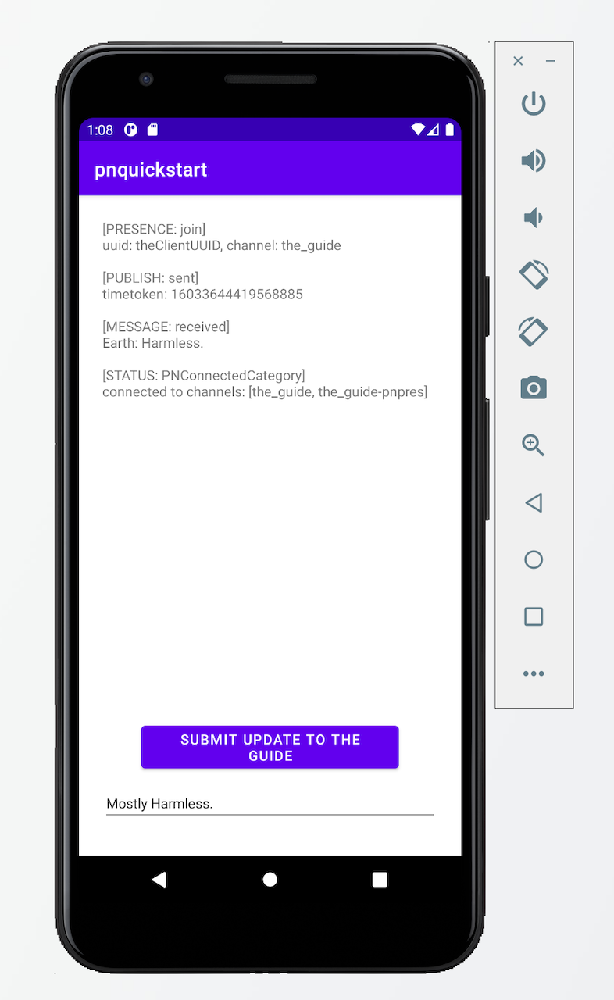

# PubNub Android Sample App

This repository contains the files required to run the [PubNub Android Quickstart](https://www.pubnub.com/docs/platform/quickstarts/android).

PubNub takes care of the infrastructure and APIs needed for the realtime communication layer of your application. Work on your app's logic and let PubNub handle sending and receiving data across the world in less than 100ms.

## Get keys

You will need publish and subscribe keys to authenticate your app. Get your keys from the [Admin Portal](https://dashboard.pubnub.com/login).

## Set up the project

If you don't want to copy the code from this document, you can clone the repository and use the files in there.
   
1. In Android Studio, create a new *Empty Activity* project named `pnquickstart`.

2. Open the module's `build.gradle` file and add the dependency to PubNub's Android SDK.
   
    ```groovy 
    dependencies {
        // existing dependencies
        implementation group: 'com.pubnub', name: 'pubnub-gson', version: '4.+'
    }
    ```
3. Synchronize the dependencies by clicking the Sync Project with Gradle Files button in the top right.

4. Navigate to your project's `manifests` directory and add the following permissions to the `AndroidManifest.xml` file:

    ```xml
    <manifest>
        <!-- existing content -->

        <uses-permission android:name="android.permission.INTERNET" />
        <uses-permission android:name="android.permission.ACCESS_NETWORK_STATE"/>
    </manifest>
    ```


## Add project files

If you don't want to copy the code from this document, you can clone the repository and use the files in there.

1. Navigate to the `res/layout` directory and open the `activity_main.xml` file in source (XML) view.

2. Overwrite the existing code with the following:

    ```xml
    <?xml version="1.0" encoding="utf-8"?>
    <RelativeLayout xmlns:android="http://schemas.android.com/apk/res/android"
    xmlns:tools="http://schemas.android.com/tools"
    android:layout_width="match_parent"
    android:layout_height="match_parent"
    android:padding="24dp">

    <ScrollView
        android:layout_width="match_parent"
        android:layout_height="match_parent"
        android:layout_above="@id/btn_submit_message"
        android:layout_alignParentTop="true">

        <TextView
        android:id="@+id/messages_text"
        android:layout_width="match_parent"
        android:layout_height="wrap_content"
        android:ems="10"
        android:enabled="true"
        android:gravity="start|top"
        android:importantForAutofill="no"
        tools:ignore="LabelFor" />
    </ScrollView>

    <Button
        android:id="@+id/btn_submit_message"
        android:layout_width="match_parent"
        android:layout_height="wrap_content"
        android:layout_above="@id/entry_update_text"
        android:layout_marginStart="40dp"
        android:layout_marginTop="10dp"
        android:layout_marginEnd="40dp"
        android:minWidth="140sp"
        android:onClick="onClick"
        android:text="Submit Update to The Guide"
        android:textSize="14sp"
        tools:ignore="HardcodedText" />

    <EditText
        android:id="@+id/entry_update_text"
        android:layout_width="match_parent"
        android:layout_height="40dp"
        android:layout_alignParentBottom="true"
        android:layout_marginTop="10dp"
        android:layout_marginBottom="10dp"
        android:ems="10"
        android:hint="enter update for Earth"
        android:importantForAutofill="no"
        android:inputType="text"
        android:text="Mostly Harmless."
        android:textSize="14sp"
        tools:ignore="HardcodedText" />
    </RelativeLayout>
    ```

    This code defines a simple user interface for the sample app. You can use the Design view to see the rendered UI. Note that this UI is intentionally simplistic.

3. Open the `MainActivity.java` class and add the following imports:

    ```java
    import android.os.Bundle;
    import android.view.View;
    import android.widget.EditText;
    import android.widget.TextView;
    import java.util.Arrays;
    import androidx.appcompat.app.AppCompatActivity;

    import com.google.gson.JsonObject;
    import com.pubnub.api.PNConfiguration;
    import com.pubnub.api.PubNub;
    import com.pubnub.api.callbacks.PNCallback;
    import com.pubnub.api.callbacks.SubscribeCallback;
    import com.pubnub.api.enums.PNStatusCategory;
    import com.pubnub.api.models.consumer.PNPublishResult;
    import com.pubnub.api.models.consumer.PNStatus;
    import com.pubnub.api.models.consumer.pubsub.PNMessageResult;
    import com.pubnub.api.models.consumer.pubsub.PNPresenceEventResult;
    import com.pubnub.api.models.consumer.pubsub.PNSignalResult;
    import com.pubnub.api.models.consumer.pubsub.message_actions.PNMessageActionResult;
    import com.pubnub.api.models.consumer.objects_api.channel.PNChannelMetadataResult;
    import com.pubnub.api.models.consumer.objects_api.membership.PNMembershipResult;
    import com.pubnub.api.models.consumer.objects_api.uuid.PNUUIDMetadataResult;
    ```

4. Still in the `MainActivity.java` file, replace the current class code with the following. Make sure that the class name is `MainActivity`. Remember to also replace the _myPublishKey_ and _mySubscribeKey_ placeholders with your keys.

    ```java
    public class MainActivity extends AppCompatActivity implements View.OnClickListener
    {
        private EditText entryUpdateText;
        private TextView messagesText;

        private PubNub pubnub;
        private String theChannel = "the_guide";
        private String theEntry = "Earth";

        @Override
        protected void onCreate(Bundle savedInstanceState) {
            super.onCreate(savedInstanceState);
            setContentView(R.layout.activity_main);

            PNConfiguration pnConfiguration = new PNConfiguration();
            // replace the key placeholders with your own PubNub publish and subscribe keys
            pnConfiguration.setPublishKey("myPublishKey");
            pnConfiguration.setSubscribeKey("mySubscribeKey");
            pnConfiguration.setUuid("theClientUUID");

            pubnub = new PubNub(pnConfiguration);

            pubnub.addListener(new SubscribeCallback() {
                @Override
                public void message(PubNub pubnub, PNMessageResult event) {
                    JsonObject message = event.getMessage().getAsJsonObject();
                    String entryVal = message.get("entry").getAsString();
                    String updateVal = message.get("update").getAsString();

                    displayMessage("[MESSAGE: received]",entryVal + ": " + updateVal);
                }

                @Override
                public void status(PubNub pubnub, PNStatus event) {
                    displayMessage("[STATUS: " + event.getCategory() + "]",
                            "connected to channels: " + event.getAffectedChannels());

                    if (event.getCategory().equals(PNStatusCategory.PNConnectedCategory)){
                        submitUpdate(theEntry, "Harmless.");
                    }
                }

                @Override
                public void presence(PubNub pubnub, PNPresenceEventResult event) {
                    displayMessage("[PRESENCE: " + event.getEvent() + ']',
                            "uuid: " + event.getUuid() + ", channel: " + event.getChannel());
                }

                // even if you don't need these handler, you still have include them
                // because we are extending an Abstract class
                @Override
                public void signal(PubNub pubnub, PNSignalResult event) { }

                @Override
                public void uuid(PubNub pubnub, PNUUIDMetadataResult pnUUIDMetadataResult) { }

                @Override
                public void channel(PubNub pubnub, PNChannelMetadataResult pnChannelMetadataResult) { }

                @Override
                public void membership(PubNub pubnub, PNMembershipResult pnMembershipResult) { }

                @Override
                public void messageAction(PubNub pubnub, PNMessageActionResult event) { }

                @Override
                public void file(PubNub pubnub, PNFileEventResult pnFileEventResult) {

                }
            });

            pubnub.subscribe().channels(Arrays.asList(theChannel)).withPresence().execute();

            entryUpdateText = findViewById(R.id.entry_update_text);
            messagesText = findViewById(R.id.messages_text);
        }

        protected void submitUpdate(String anEntry, String anUpdate) {
            JsonObject entryUpdate = new JsonObject();
            entryUpdate.addProperty("entry", anEntry);
            entryUpdate.addProperty("update", anUpdate);

            pubnub.publish().channel(theChannel).message(entryUpdate).async(
                    new PNCallback<PNPublishResult>() {
                        @Override
                        public void onResponse(PNPublishResult result, PNStatus status) {
                            if (status.isError()) {
                                status.getErrorData().getThrowable().printStackTrace();
                            }
                            else {
                                displayMessage("[PUBLISH: sent]",
                                        "timetoken: " + result.getTimetoken());
                            }
                        }
                    });
        }

        protected void displayMessage(String messageType, String aMessage) {
            String newLine = "\n";

            final StringBuilder textBuilder = new StringBuilder()
                    .append(messageType)
                    .append(newLine)
                    .append(aMessage)
                    .append(newLine).append(newLine)
                    .append(messagesText.getText().toString());

            runOnUiThread(new Runnable() {
                @Override
                public void run() {
                    messagesText.setText(textBuilder.toString());
                }
            });
        }

        @Override
        public void onClick(View view) {
            submitUpdate(theEntry, entryUpdateText.getText().toString());
            entryUpdateText.setText("");
        }
    }
    ```

## Run the app

If this is your first Android Studio project, create an emulator before you follow these steps.

1. Click the Run button.

    You should see an Android emulator similar to this:

    

    The UI is simple, and the message display area is initially obscured by the keyboard. Dismiss the keyboard to see more of the messages.

    The app publishes a message at startup, and displays some other messages and events.

2. Submit a new entry.

    A new entry update is auto populated for you: "Mostly Harmless." Change the text if you'd like, then click the Submit Update to the Guide button to publish the new update. The new update appears at the top of the current messages, while the older messages scroll down, and the entry update field is cleared for you to enter something new.

    > This code is executed asynchronously, so the order in which the [MESSAGE: received] and [PUBLISH: sent] messages appear may vary.

## Documentation

* [Build your first realtime Android app with PubNub](https://www.pubnub.com/docs/platform/quickstarts/android)
* [API reference for Android (Java)](https://www.pubnub.com/docs/android-java/pubnub-java-sdk)
* [API reference for Java](https://www.pubnub.com/docs/java-se-java/pubnub-java-sdk)

## Support

If you **need help** or have a **general question**, contact <support@pubnub.com>.
